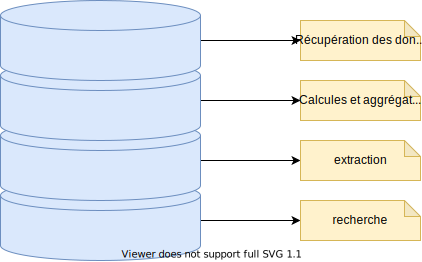

<head>
<link rel="stylesheet" href="plugin/chalkboard/style.css">
<link rel="stylesheet" href="plugin/customcontrols/style.css">
<link rel="stylesheet" href="https://maxcdn.bootstrapcdn.com/font-awesome/4.5.0/css/font-awesome.min.css">

</head>

# Historique des besoins pour les bases de données

### Des années 70 à nos jours

----

## Qu'est ce qu'une base de données ?

----

### Définition d'une base de données selon [Wikipedia](https://fr.wikipedia.org/wiki/Base_de_donn%C3%A9es)

> Une base de données permet de stocker et de retrouver des données structurées,
> semi-structurées ou des données brutes ou de l'information,
> souvent en rapport avec un thème ou une activité ;
> celles-ci peuvent être de natures différentes et plus ou moins reliées entre elles.

----
## Stocker

* Historiquement vue comme un entrepôt de données.
* Persistance sur le temps des données.
* Archivage des données

----
## Retrouver des données

* Recherche des données stocker
* Création d'historique
* Agrégation et calcules

----
## Données ou informations
## Données ou informations
* Données utilisateurs
* Données financières
* Données des événements
* Données diverses

----
## Structurées ou Semi-structurées
* Données avec un format strict
* Données avec des formats qui peuvent être différents
* Ranger les données

----
## En rapport avec un thème ou une activité
* Pour les applications web
* Pour la gestion de systèmes
* Pour la création de moteurs de recherche
* Pour archiver nos informations

----
## De nature différentes
* Hiérarchiques
* Relationnel
* NoSQL
* Object
* NeoSQL

----
## Plus ou moins reliées entre elles
* BigData
* Système distribué
* Cluster

---
# Historique
----
### Historique: les années 60

* `1956` Invention des disques durs de grande capacité
* `1960` Premières bases de données hiérarchiques
* `1964` Première utilisation du terme `base de données`
* `1965` Conception de l'architecture `ainsi/Sparc`
----
### Historique: les années 70
* `1970` Thèse mathématiques sur l'algèbre relationnelle`
* `1970` Première version du langage `SEQUEL`
* `1979` Première version commerciale du SQL (Oracle)
----
### Historique: les années 80 et 90
* `1986` Première norme ISO (ISO/CEI 9075: 1986 ou SQL-86)
* `1992` Version majeure SQL2 ou SQL-92
* `1997` Apparition du terme `big data`
* `1999` Version majeure SQL-99 avec l'ajout de fonctionnalités comme les déclencheurs, expressions rationnelles

----
### Historique: les années 80 et 90

* Apparition d'internet et des premiers logiciels de `cloud computing`.
----

### Historique: les années 2000
* Arrivée des géants du web (Amazon, Google, Facebook) avec de nouveaux besoins dus à l'évolution de la taille des données.
* `2001` Popularisation de l'approche `Agile`
----

### Historique: les années 2000
* `2004` Développement de BigTable par Google
* `2007` Utilisation par Amazon de Dynamo Db
* `2007` Sortie de l'Iphone et émergence des smartphones.
* `2008` Première version de Cassandra (Facebook)
* `11 juin 2009` Convention NoSQL où le terme NoSQL est utilisé pour la première fois.

---

# Quelques chiffres

----
### Nombre de messages WhatsApp chaque minute

# `41 666 6 67

----
### Nombre de recherche google en 2021

# plus de `2 Trilliards`

----
### Consommation des données dans le monde en 2021

# `74 ZettaBytes`

ou 74 * 2 puissances 70 bytes

----
### Estimation de la consommation des données dans le monde en 2024

# `149 ZettaBytes`

ou 74 * 2 puissances 70 bytes

----
### Nombre de Tweets en 2020

# `500 Millions par jour`

---

## Les problématiques du stockage de l'information

----
## La taille
Nous stockons et utilisons de plus en plus de données

----
## La disponibilité
Nous voulons avoir accès à nos données à tout moment

----
## La rapidité
Nous voulons avoir des systèmes rapides:
* En lecture
* En écriture
* En ingestion de données.

----
## La diversité
Nous avons besoin de stocker et traiter des données de format et tailles diverses

----
## La sécurité
Nos données ont besoin d'être sécurisées

----
## La cohérence
Nos données doivent souvent garder une cohérence.

----
## La résilience aux pannes
Nous devons utiliser des systèmes ayant une forte tolérance aux pannes pour éviter les pertes de données et faire en sorte qu'elles soient toujours disponibles.