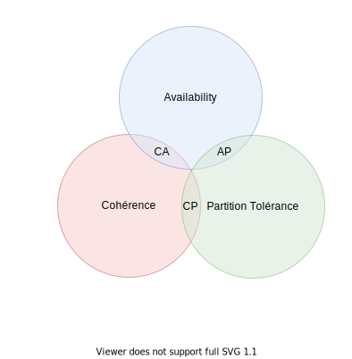

<head>
<link rel="stylesheet" href="plugin/chalkboard/style.css">
<link rel="stylesheet" href="plugin/customcontrols/style.css">
<link rel="stylesheet" href="https://maxcdn.bootstrapcdn.com/font-awesome/4.5.0/css/font-awesome.min.css">

</head>

# Principe et Théorèmes
Pour les bases de données.

---

# Théorème du CAP

> Un système distribué ne peut fournir que deux des trois caractéristiques souhaitées : cohérence (`Consistency`), disponibilité (`Availability`) et tolérance au partitionnement (`Partition tolérance`)
----
# Théorème du CAP

----

## Cohérence ou Consistency

Tous les noeuds du système voient exactement les mêmes données au même moment.

----

## Disponibilité ou Availability

Garantie que toutes les requêtes reçoivent une réponse

----
## Tolérance au partitionnement ou Partition tolerance

Aucune panne moins importante qu'une coupure totale du réseau ne doit empêcher le système de répondre correctement.

----

----
## Base de données CA

Principalement les bases de données relationnelles
* Oracle
* My Sql
* SQLServer
* PostreSQL
* DB2

----
## Base de données AP
* Redis
* Spark
* Elasticsearch
* Neo4 j

----
## Base de données CP
* H. Base
* Big Table

----
## Base de données qui peuvent être AP ou CP

Le théorème definit qu'un système ne peut pas être CAP en `même temps`.

Certaines bases de données peuvent choisir entre AP et CP
----
## Base de données qui peuvent être AP ou CP
* Mongo Db (par défaut CP)
* Cosmos Db (par défaut CP)
* Cassandra (par défaut AP)
* Dynamo Db (par défaut AP)

---
# ACID

Principes pour les transactions

----
## Atomicité

Une transaction s'effectue entièrement ou pas du tout

----
## Cohérence

Le contenu d’une base doit être cohérent au début et à la fin d’une transaction

----
## Isolation

Les modifications d’une transaction ne sont visibles/modifiables que quand celle-ci a été validée

----
## Durabilité

Une fois la transaction validée, l’état de la base est permanent (non affecté par les pannes ou autres)

----
## Les bases non ACID

Ces propriétés ne sont pas applicables dans un contexte distribué tel que les bases de données No sql.

---
# BASE

Caractéristiques des bases de données No Sql

----
## Basically Available

Quelle que soit la charge de la base de données, le système garantit un taux de disponibilité de la donnée.

----
## Soft-state

La base peut changer lors des mises à jour ou lors d'ajout/suppressions de serveurs.

La base NoSQL n'a pas à être cohérente à tout instant.

----
## Eventually consistent

À terme, la base atteindra un état cohérent.

----
## BASE

Les bases de données NoSQL favorisent l'efficacité en sacrifiant certaines contraintes (dont celles ACID).

---
## ACID/BASE

* ACID: Fortes contraintes, mais temps de réponse plus faible.

* BASE: Faibles contraintes, mais meilleur temps de réponse.

---
## Les 3 ou 5 V du BigData

> Les ensembles de données traités correspondant à la définition du big data répondent à trois caractéristiques principales : volume, vélocité et variété.

Définition du bigdata par la [CNIL](https://www.cnil.fr/fr/definition/big-data)

----
## Les trois premiers V

En 2001, Douglas Laney a défini les 3 premiers V du big Data.

----
### Volume

Les systèmes se disant du `BigData` peuvent gérer un grand nombre de données et supporter son accroissement.

----
### Vélocité

Les données doivent être collectées, traitées rapidement, voire même en temps réel.

----
### Variété

Les données peuvent prendre des formes très variées et très hétérogènes.

----
### Les deux autres Vs

Par la suite, deux autres Vs ont pu être identifiés.

----
### Valeur

Les données peuvent apporter de la valeur.

----
### Véracité

Les données doivent être fiables, valides et de qualité.
