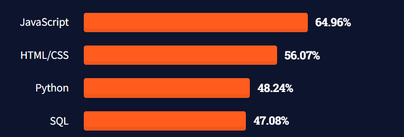
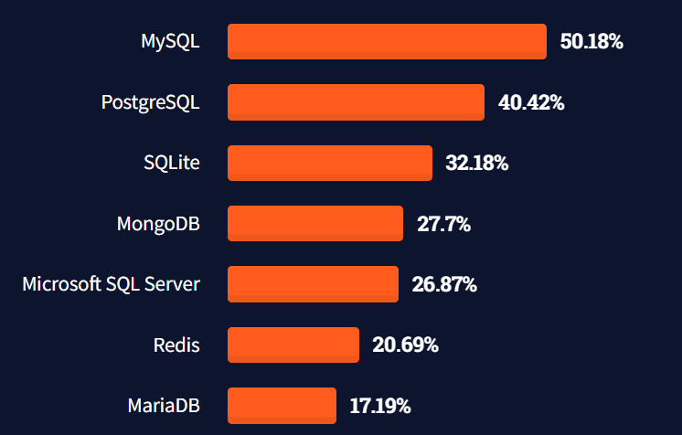

# Le modèle relationnel

---
## Définition d'un SGBDR

Les systèmes de gestion de Base de Données relationnelles sont des logiciels qui reposent sur le modèle relationnel.

----
## Principales fonctionnalités

* La définition des données sous forme de relations
* La manipulation des données par un langage déclaratif.
* L'administration des données.

----
## Relationnelles = jointures?

Non!

Le terme `relationnel référence à `l'algèbre relationnelle`.

----
## Le modèle relationnel

Les données sont stockées dans des `tables`.

|Clé|Nom|Prenom|
|---------|---------|----------|
|1|Vossough|Adrien|
|2|Raoux|Killian|
|3|Routier|Benoit|

----

## Le modèle relationnel

Nous pouvons utiliser un langage déclaratif comme le `SQL`pour interagir avec les tables.

```SQL
SELECT nom, prenom FROM ma_table
```
|Nom|Prenom|
|---------|----------|
|Vossough|Adrien|
|Raoux|Killian|
|Routier|Benoit|

----

## Le modèle relationnel

Les données sont rangées en `enregistrement` ou `record` sous forme de n-tuplet.

Les tables possèdent des `colonnes` définies à l'avance.

----

## Le modèle relationnel

Les tables possèdent une structure finie qui peut être difficile à modifier.

```SQL
CREATE TABLE ma_table (
    cle INT PRIMARY KEY,
    nom VARCHAR(32),
    prenom VARCHAR(32)
)
```

----

## Le modèle relationnel

Les `tables` sont rangées dans des `bases de données`.

```
base_1
∟ table_1
∟ table_2
∟ table_3
base_2
∟ table_1
∟ table_2
∟ table_3
```
---

## Le SQL, un langage unique ?

Oui... et non.

SQL est une `norme` de langage.

Chaque SGBDR à la possibilité de l'étendre, voir le modifier en fonction des particularités et fonctionnalités.

----
### Les differences entre les SGBDR

Par exemple, la fonction `CONVERT` est differente entre `MySQL`et `SQLServer`

MySQL
```SQL
CONVERT(expression, type)
```
SQL Server
```SQL
CONVERT(type, expression)
```

----

### Les differences entre les SGBDR

Les types peuvent être different entre les differents SGBDR.

----
### Les differences entre les SGBDR

Les principales différences entre les SGBDR sont principalements pour de l'utilisation avancée et l'administration.

Il est donc facile pour un utilisateur de MySQL d'utiliser un autre SGBDR.

---
# Les points forts des SGBDR
----

## Les points forts des SGBDR: SQL

* Langage connu par une majorité des développeurs.
* Langage simple.
* Permet de faire la majorité des opérations sur les données.

----

## Les points forts des SGBDR: SQL



[sondage StackOverflow 2021](https://insights.stackoverflow.com/survey/2021#technology-most-popular-technologies)
----

## Les points forts des SGBDR: La structure des données.

Proche d'une structure Excel

### `750 million d'utilisateurs `
d'après microsoft.

----

### Les points forts des SGBDR: Types de SGBD le plus courant



[sondage StackOverflow 2021](https://insights.stackoverflow.com/survey/2021#technology-most-popular-technologies)

----

### Les points forts des SGBDR: ACID

Les SGBDR permettent souvent d'utiliser des transactions ACID.

----

### Les points forts des SGBDR: Rapide

Ils sont performants pour les requêtes simples.

----

### Les points forts des SGBDR: Généraliste

Ils s'adaptent correctement à la plupart des besoins.

----

### Les points forts des SGBDR: Structure

Ils proposent une structure de données structurée et fixe qui limite les erreurs.

---

## Les points faibles des SGBDR

----

### Les points faibles des SGBDR: Structuré

Il est difficile de faire évoluer la structure de la base de données sur le long terme.

----

### Les points faibles des SGBDR: Rigidité

Il est difficile de faire l'architecture du système.

----

### Les points faibles des SGBDR: DB first

Il est souvent préférable d'adapter le code de nos applications en fonction de la structure de la base de données.

----

### Les points faibles des SGBDR: CA

N'est pas tolérant au partitionnement.

----

### Les points faibles des SGBDR: Outil générique.

Les SGBDR peuvent être utilisés dans de nombreux cas, mais ne proposent pas les meilleures performances.

----

### Les points faibles des SGBDR: L'évolution du volume

Il est difficile de faire évoluer le volume des données.

Il ajoute des données, diminue les performances.

----

### Les points faibles des SGBDR: faibles performances pour certains besoins

Ils ne sont pas adaptés à certains besoins :
* Moteur de recherche.
* DataLake
* Mise en cache
* Données complexes
* Recherche dans des graphes

---

## Analogie du marteau

Les SGBDR sont comme les marteaux : 

* Pratiques et permettent de faire beaucoup de choses.

* Pas adaptés pour tous les besoins.