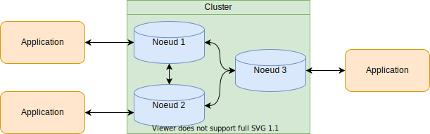
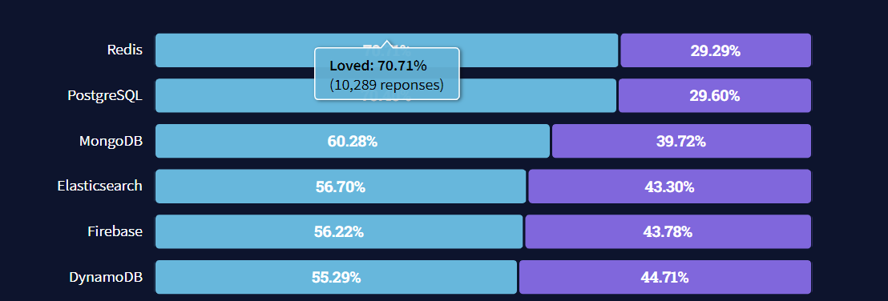
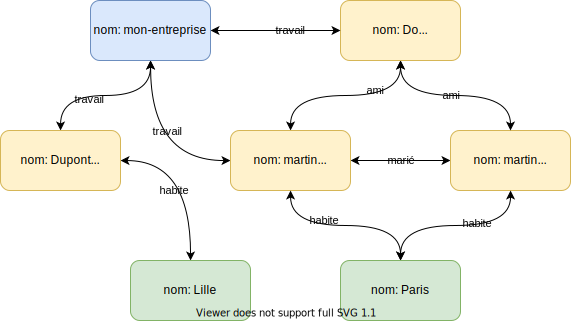
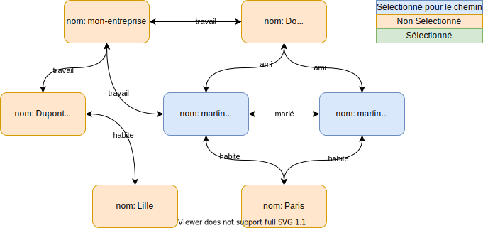
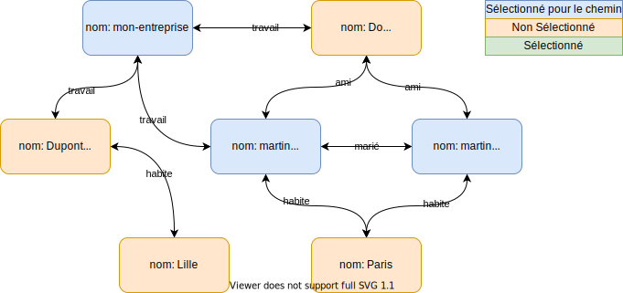
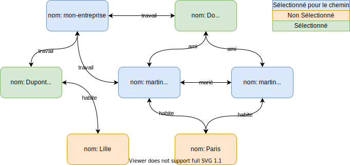

# NoSQL

---

## Not Only SQL

`No SQL` ne veut PAS dire Non SQL mais Not Only SQL.

----

### NoSQL le besoin

Le NoSQL vient des nouveaux besoins des années 2000.

----
### Une famille de SGBD

Le NoSQL est une famille de base de données.

Les SGBD NoSQL sont souvent mis en opposition aux SGBDR.

----
### Ils proposent de retirer les contraintes du SQL
* La structure
* Le langage d'interrogation
* Cohérence des données.

----

### Favorise la distribution

La diminution des contraintes a pour but de favoriser la distribution des données.

---
## NoSQL et BigData

Les SGBD NoSQL ont souvent pour but de répondre aux 3 V du BigData.

Ils sont des outils importants des architectures du BigData.

----
### Volume

Ils favorisent la distribution des données permettant de suivre l'accroissement du volume des données avec moins de modifications que les SGBDR.

----
### Velocity

Ils proposent des performances supérieures que les SGBDR pour leurs besoins.

Ils sont plus spécialisés et donc optimisés pour certains cas d'utilisation.

----
### Variety

Ils proposent souvent de prendre en charge des données semi-structurées, voire des données brutes.

---
## BASE et CAP

Ils ne respectent pas tous les principes ACID mais favorisent les principes BASE.

Ils sont pour la plupart CP ou AP dans le triangle de CAP.

---
## Les Clusters NoSQL

----
### Définition Cluster

Un cluster est une architecture distribuée dans laquelle un ensemble de noeuds travaillent ensemble pour repondre aux besoins.

----



----

### Forces de la cauterisation

* `scalling vertical` possibilité de déployer le système sur plusieurs servers pour répartir les charges.

* Facilement extensible : pour ajouter de la puissance ou du stockage, il est possible d'ajouter de nouvelles instances.

* Meilleure tolerances aux pannes.

* Haute disponibilité.

* Meilleurs temps de réponse.

* Haute capacité d'ingestion.
----

### Administration automatique du cluster

* Ils proposent souvent des systèmes automatiques pour la gestion automatique du cluster.
    * Répartition des charges automatiques.
    * Répartition du stockage.
    * Optimisation des lectures et écritures sur les nœuds.
    * Spécialisation des nœuds.
    * Répartition des charges géographiques.

----

### Technologies du Cloud

Les SGBD NoSQL sont souvent utilisés dans des environments Cloud.

---
## Les Familles NoSQL

----

### Un seul type de SGBD?

Non. Chaque SGBD NoSQL propose ses fonctionnalités.

Il existe tout de même 4 grandes familles de SGBD NoSQL.

---
## Les Clé-Valeur

----

### Les Clé-Valeur

* Ne possèdent pas de schéma. 
* Simple.
* Utilisent une clé pour identifier des valeurs.
* Proche d'un annuaire ou d'un dictionnaire.

----

### Exemple

| Clé | Valeur |
|---|---|
| nombre-connection | 12124 |
| config | {"host":"mon-site","description":"une description"}|
| un-text | "un super text" |

----
### Opérations CRUD

Les commandes sont souvent simple.

```redis
SET ma-cle "une valeur"

GET ma-cle

REMOVE ma-cle
```

----
### Forces des clé-valeurs
* Facile d'utilisation
* Facile d'administration
* Haute performance
* Proche du temps réel

----
### Faiblesses des clé-valeurs
* Aucune structure
* Les rechecks se font uniquement sur les clés
* Souvent limité dans le volume
* Ne sont pas fait pour la persistance à long terme.
* Haute disponibilité
* Pas de relations entre les données.
----
### Cas d'utilisation
* Mise en cache
* Historique
* Buffer
* Gestion de panier d'achat
* Collecte d'événement
* PubSub
----
### Quelques SGBD Clé-valeurs
<div class="container-col">
    <div class="container-row">
        <div>Redis</div>
        <div>
            
        </div>
    </div>
    <div class="container-row">
        <div>Amazon DynamoDB</div>
        <div>
            
        </div>
    </div>
    <div class="container-row">
        <div>Azure CosmosDB</div>
        <div>
            
        </div>
    </div>
</div>

----
### Redis et DynamoDB



---

## Orienté Colonnes

----
### Orienté Colonnes

Les données sont proches dans la représentation des SGBDR

|id|Age|Taille|Poids|
|---|---|---|---|
|Truc|45|184|75|
|bidule|32|172|71|
|Machin|28|179|85|

----
### Orienté Colonnes

Les SGBD se focalisent plus sur les attributs (colonnes) que les entités (lignes)
pour s'orienter sur des calculs analytiques.

----
### Peuvent utiliser des langages proches du SQL

Exemple de requêtes CQL de Cassandra.

```CQL
SELECT id, age, taille, poids
FROM ma_table
WHERE 
    age > 18;
```

----
### Les forces des SGBD Orienté Colonnes
* Flexibilité
* Temps de traitement
* Non stockage des valeurs null
* Historisation des valeurs
* Forte injection
* Gros volume de données

----
### Les faiblesses des SGBD Orientées Colonnes
* Non-adaptées aux relations entre les données.
* Non-adaptées aux données complexes.

----
### Cas d'utilisations
* Stockage de gros volume.
* gestion d'événement.
* DataLake
* Moteur de recherche.
* Calcule statistique.

----
### Quelques SGBD Orientées colonnes

<div class="container-col">
    <div class="container-row">
        <div>Cassandra</div>
        <div>
            
        </div>
    </div>
    <div class="container-row">
        <div>GCP BigTable</div>
        <div>
            
        </div>
    </div>
    <div class="container-row">
        <div>Apache HBase</div>
        <div>
            
        </div>
    </div>
    <div class="container-row">
        <div>Elasticsearch</div>
        <div>
            
        </div>
    </div>
</div>

---
## Orienté Document

----
### Orienté Document

Stocke des documents souvent au format JSON.

Repose sur le principe du clé/valeur, mais avec une extension sur les champs qui composent ce document.

Les données ne sont pas limitées au format des lignes dans une table.

----
### Orienté Document

Exemple de document.

```Json
{
    "_id":"507f1f77bcf86cd799439011",
    "nom":"Raoux",
    "prenom":"Killian",
    "adresse":{
        "ville":"Lille",
        "rue":"Avenue de la paix",
        "code postal":59000
    },
    "langages":[
        "Java", "Python", "C#", "Typescript", "SQL"
    ]
}
```

----
### Orienté Document

Equivalent SGBDR

Utilisateurs

|id|nom|prenom|adresse_id|
|---|---|---|---|
|1|Raoux|Killian|1|

----
### Orienté Document

Adresses

|id|ville|rue|code_postal|
|---|---|---|---|
|1|Lille|Avenue de la paix| 59000|

----
### Orienté Document
Langages

|id|utilisateur_id|nom|
|---|---|---|
|1|1|Java|
|2|1|Python|
|3|1|C#|
|4|1|Typescript|

----
### Exemple de requête

```js
db.utilisateurs.find({"nom":"Martin", "prenom":"Dupont"})
```

Cette requête retourne la liste des utilisateurs ayant pour nom "Martin" et prénom "Dupont" avec mongoDB.

Equivalent SQL:
```SQL
SELECT * 
FROM
    utilisateur AS u,
    JOIN address AS a ON u.adresse_id == a.id
    JOIN langages AS l ON u.id == utilisateur_id
WHERE 
    u.nom == "Martin"
    AND u.prenom == "Dupont"
```

----
### Exemple de requête

* Les SGBDR doivent effectuer des jointures ou plusieurs requêtes pour récupérer l'ensemble des données et reconstruire une requête.
Ce qui prend plus temps.

* Les SGBD Document n'ont besoin que d'une unique requête. Ce qui est beaucoup plus rapide.

----
### Les forces des SGBD Orienté Document
* Permettent de stocker des données complexes.
* Plus performantes pour la récupération de données hiérarchiques.
* Ne nécessitent pas toujours de structure prédéfinie.
* Permettent le développement d'applications Code-first.

----
### Les faiblesses des SGBD Orienté Document
* Peu adaptés aux relations entre les données.
* Langages de requêtes spécifiques

----
### Cas d'utilisation
* Données clients
* Gestion de données complexe.
* Le web Analytics.

----
### Quelques exemples
<div class="container-col">
    <div class="container-row">
        <div>MongoDB</div>
        <div>
            
        </div>
    </div>
    <div class="container-row">
        <div>GCP BigTable</div>
        <div>
            
        </div>
    </div>
</div>

---
## Orientés graphes

----
### Orientés graphes

Les SGBD orientés graphes se focalisent sur les relations entre les données et pas les données elles-mêmes.

Ils se basent sur la théorie des graphes.

----
### Orientés graphes

Les données et leurs relations sont représentées sous forme de noeuds (les données) et des liaisons (leurs relations).

Les requêtes se font sur les liaisons.

----
### Orienté Graphes



----
### Les langages des SGBD Orientés graphes

Ils utilisent des langages spécifiques à leurs besoins.

Contrairement au SQL, les liaisons entre les données portent un nom.

----
### Exemple avec Neo4j
Exemple d'une requête Cypher de Neo4j:

```Cypher
MATCH (:Personne {nom:"Martin"})-[:Travail]->(:Entreprise)
    -[:Travail]->(collaborateur:Personne)
RETURN collaborateur.nom, collaborateur.prenom
```

Retourne les personnes qui travaillent dans la même entreprise, que les personnes ayant comme nom "Martin".

----
### Exemple avec Neo4j

* `MATCH` est equivalent au `WHERE`.
* `(:Personne {nom:"Martin"})` filtre les noeuds de depart de type *Personne* et ayant l'attribut *nom* valant *Martin*.




----
### Exemple avec Neo4j
* `-[:Travail]->` définie une liaison entre deux nœuds. Cette liaison doit être de type `Travail`



----
### Exemple avec Neo4j
* `(collaborateur: personne)` recherche les nœuds du type *personne respectant la liaison précédente.
* Il stocke les valeurs du noeud sous le label collaborateur.



----
### Exemple avec Neo4j
Résultats:

|nom|prenom|
|---|---|
|Do|John|
|Dupont|Jack|

----
### Quelles différences avec les jointures SQL?
* Les jointures SQL sont accéléréEs avec l'indexation des clés primaires.
* Neo4j indexe les jointures en elle-même.
* Neo4j est beaucoup plus rapide que les SGBDR pour le chaînage des jointures.

----
### Quelles différences avec les jointures SQL?
Benchmark pour une requête de jointure sur une base de 1 000 000 utilisateurs :

|Profondeur|Temps d'execution MySQL| Temps déxécution Neo4j|
|---|---|---|
|2|0.016|0.010|
|3|30.267|0.168|
|4|1 543.505|1.359|
|5|Non fini en 1h|2.132|

[Benchmark MySQL et Neo4j](https://neo4j.com/news/how-much-faster-is-a-graph-database-really/#:~:text=For%20the%20simple%20friends%20of,on%20the%20depth%205%20query.)

----
### Cas d'utilisations
* Recherche sur des réseaux.
* Données avec beaucoup de liaisons
* Données de types graphes
* Analyse BigData pour les liaisons entre utilisateurs ou données.

----
### Points forts
* Rapide pour les résolutions de connexions.
* Affichage sous forme de graphes.

----
### Points faibles
* Spécifiques pour certaines utilisations.
* Grande consommation de mémoire.
* Lent en écriture.
* Outils d'analyse et de recherche et non de stockage.

----
### Quelques exemples
<div class="container-col">
    <div class="container-row">
        <div>Neo4j</div>
        <div>
            
        </div>
    </div>
    <div class="container-row">
        <div>Azure CosmosDB</div>
        <div>
            
        </div>
    </div>
</div>

---
### Quelques chiffres

----
### Popularité

Les SGBD NoSQL gagnent de plus en plus de popularité avec le temps.

[stackoverflow survey](https://insights.stackoverflow.com/survey/2021#most-loved-dreaded-and-wanted-database-want)

[db-engine](https://db-engines.com/en/ranking)

----
### Nouveaux langages

Les SGBD NoSQL se veulent plus proches des besoins des développeurs.

En général, elles proposent des langages proches des langages de développement moderne comme le Json ou la norme REST.

