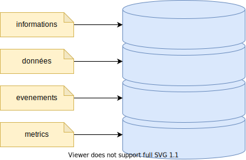
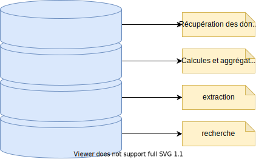

<head>
<link rel="stylesheet" href="plugin/chalkboard/style.css">
<link rel="stylesheet" href="plugin/customcontrols/style.css">
<link rel="stylesheet" href="https://maxcdn.bootstrapcdn.com/font-awesome/4.5.0/css/font-awesome.min.css">

</head>

# Historique des besoins pour les bases de données

### Des années 70 à nos jours

----

## Qu'est ce qu'une base de données ?

----

### définition d'une base de données selon [Wikipedia](https://fr.wikipedia.org/wiki/Base_de_donn%C3%A9es)

> Une base de données permet de stocker et de retrouver des données structurées, 
> semi-structurées ou des données brutes ou de l'information, 
> souvent en rapport avec un thème ou une activité ; 
> celles-ci peuvent être de natures différentes et plus ou moins reliées entre elles.

----
## Stocker

* Historiquement vue comme un entrepot de donnée.
* Persistance sur le temps des données.
* Archivage des données

----
## Retrouver des données

* Recherche des données stocker
* Création d'historique
* Agrégation et calcules

----
## Données ou informations
## Données ou informations
* Données utilisateurs
* Données financièresd
* Données des événements
* Données diverses

----
## Structurées ou Semi-structurées
* Données avec un format strict
* Données avec des formats qui peuvent être différents
* Ranger les données

----
## En rapport avec un thème ou une activité
* Pour les applications web
* Pour la gestion de système
* Pour la création de moteur de recherche
* Pour archiver nos informations

----
## De nature différentes
* Hiérarchiques
* Relationnel
* NoSQL
* Object
* NeoSQL

----
## Plus ou moins reliées entre elles
* BigData
* Système distribué
* Cluster

---
# Historique
----
### Historique: les années 60

* `1956` invention des disques durs de grande capacité
* `1960` Premières bases de données hiérarchiqes
* `1964` Première utilisation du terme `base de données`
* `1965` Conception de l'architecture `ainsi/Sparc`
----
### Historique: les années 70
* `1970` thèse mathématiques sur l'algèbre relationnelle`
* `1970` Première version du langage `SEQUEL`
* `1979` Première version commerciale du SQL (Oracle)
----
### Historique: les années 80 et 90
* `1986` Première norme ISO (ISO/CEI 9075: 1986 ou SQL-86)
* `1992` version majeure SQL2 ou SQL-92
* `1997` apparition du terme `big data`
* `1999` version majeure SQL-99 avec l'ajout de fonctionnalités comme les déclencheurs, expressions rationnelles

----
### Historique: les années 80 et 90

* Apparition d'internet et des premiers logiciels de `cloud computing`.
----

### Historique: les années 2000
* Arrivées des géants du web (Amazon, Google, Facebook) avec de nouveaux besoins dus à l'évolution de la taille des données.
* `2001` popularisation de l'approche `Agile`
----

### Historique: les années 2000
* `2004` développement de BigTable par Google
* `2007` utilisation par Amazon de Dynamo Db
* `2007` Sortie de l'Iphone et émergence des smartphones.
* `2008` Première version de Cassandra (Facebook)
* `11 juin 2009` Convention NoSQL où le terme NoSQL est utilisé pour la première fois.

---

# Quelques chiffres

----
### Nombre de messages WhatsApp chaque minute

# `41 666 6 67

----
### Nombre de recherche google en 2021

# plus de `2 Trilliards`

----
### Consommation des données dans le monde en 2021

# `74 ZettaBytes`

ou 74 * 2 puissances 70 bytes

----
### Estimation de la consommation des données dans le monde en 2024

# `149 ZettaBytes`

ou 74 * 2 puissances 70 bytes

----
### Nombre de Tweets en 2020

# `500 Millions par jour`

---

## Les problèmatiques du stockage de l'information

----
## La taille
Nous stockons et utilisons de plus en plus de données

----
## La disponibilité
Nous voulons avoir accès à nos données à tout moment

----
## La rapidité
Nous voulons avoir des systèmes rapides:
* En lecture
* En écriture
* En ingestion de données.

----
## La diversité
Nous avons besoin de stockées et traités des données de format et tailles diverses

----
## La sécurité
Nos données ont besoin d'être sécurisé

----
## La cohérence
Nos données doivent souvent garder une cohérence.

----
## La résilience aux pannes
Nous devons utiliser des systèmes ayant une forte tolérance aux pannes pour éviter les pertes de données et toujours être disponible.ant une forte tolerence aux pannes pour éviter les pertes de données et toujours etre disponible.