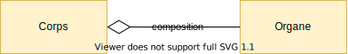

# MongoDB


---
## Architecture de mongoDB

MongoDB ne fonctionne pas avec des tables.

À la place il utilise des Collections

----
### Architecture de mongoDB

| SGBDR          | MongoDB        |
|----------------|----------------|
| Base de donnée | Base de donnée |
| Table          | Collection     |
| Colonne        | propriétés     |

----
### Les types

MongoDB utilise le format JSON pour le stockage des données.

| MySQL Type           | MongoDB Type | Json syntaxe |
|----------------------|--------------|--------------|
| VARCHAR, TEXT        | String       | ""           |
| SHORT, INTEGER, LONG | Number       | 1            |
| DECIMAL, FLOAT       | Number       | 1.1          |
| TINY INT             | Boolean      | true/false   |
| X                    | Object       | {}           |
| X                    | Array        | []           |

----
### Les ids

Pour une optimisation de l'indexation, MongoDB utilise des ObjectId pour les ids.
* Exemple `507f1f77bcf86cd799439011`
* Ils sont composés de 12 octets retranscrits en 24 characters hexadecimal.
* Contrairement a l'utilisation classique des clés primaires avec les SGBDR, 
les ids sont uniques à l'échelle de la base de données.
* 7 * 10^28 clés possibles.

---
## Les données


----
### Agrégations vs Compositions

Il est important de comprendre la difference entre des données structurées en agrégation ou composition.

----
### Agrégation

Deux données ont une association d'agrégation quand ils peuvent exister l'un sens l'autre.

> Les livres d'une bibliothèque peuvent exister sans la bibliothèque.


----
### Composition

Deux données ont une association de composition quand l'un ne peut pas exister sans l'autre.

> Les organes du corps humain sont détruit quand le corps n'existe plus.



----
### MongoDB et composition

MongoDB gagne en performance pour les associations de composition.

Il est moins performant pour les associations d'agrégation.

----
### Exemple

Un utilisateur et ses informations peuvent être représenté au format JSON et donc avec des associations de composition.

```json
{
  "_id": "507f1f77bcf86cd799439011",
  "nom": "Raoux",
  "prenom": "Killian",
  "adresse": {
    "ville": "Lille",
    "rue": "Avenue de la paix",
    "codePostal": 59000
  },
  "langages": [
    "Java","C#", "C", "Typescript"
  ],
  "loisirs": [
    {"nom": "Piano","type":"musique", "temps": "5 ans"},
    {"nom": "Guitare","type":"musique", "temps": "10 ans"},
    {"nom": "Course à pieds","type":"sport", "courses": [
      {"nom":"10 KM de Paris","date": "2019"}
    ]}
  ]
}
```

----
### Exemple

Ces données demande 5 tables avec un SGBDR.

Pour récupérer cette donnée en SQL nous aurions besoin de jointures et d'effectuer plusieurs requêtes.

Avec MongoDb:
```js
db.utilisateurs.find({"_id":"507f1f77bcf86cd799439011"})
```

----
### Non-Structuré

Il est possible de mettre des données avec des structures différentes dans la même collection.
* Les documents peuvent ne pas avoir les mêmes propriétés.
* Les propriétés peuvent ne pas avoir les mêmes types.
* Les tableaux peuvent contenir des objects de types différents.

----
### Les liaisons inter-document

MongoDB n'a pas de système de jointure au sens du SQL.

Il utilise un système de référence qui est géré par le client et non le serveur.

Il n'est donc pas possible de faire des requêtes sur des données issues d'une référence.

---
## MongoDB dans vos applications

----
### MongoDB et les langages de programmations

MongoDB possède, tout comme les SGBDR, un driver disponible dans plusieurs langages.
* Actionscript
* C, C#, C++, Clojure info , ColdFusion, 
* D, Dart, Delphi, Erlang
* Go, Groovy, Haskell
* Java, JavaScript
* Lisp, Lua, MatLab, 
* Perl, PHP, PowerShell, Prolog, Python
* R, Ruby,Rust
* Scala, Smalltalk, Swift

----
### MongoDB et architecture applicatif

La non-structure des données demande de prendre en charge la structure dans le code et non dans la base de données.

Ce qui met en avant des stratégies de développement comme le code-first.

L'utilisation de ce type de SBD permet aussi de diminuer l'importance de l'administration des bases de données.

----
### MongoDB et le BigData

MongoDB propose offre une API pour l'utilisation d'outils comme MapReduce ce qui permet sont utilisation entant que
DataLake.

---
### MongoDB mono-node avec Docker

----
### MongoDB mono-node avec Docker
Docker Compose

```docker-compose
version: '3.7'

services:
  mongo:
    image: mongo
    ports:
    - 27017:27017
```

---
## MongoDB cli

----
### MongoDB cli

MongoDB propose un CLI disponible acessible avec la commande mongo:

```shell
> mongo
```

----
### MongoDB CLI et javascript

MongoDB CLI utilise la norme EGMAScript comme le Javascript comme langage.

> Attention: ce n'est pas du NodeJS ou de Javascript DOM. 
> Des fonctions comme console.log ne sont pas disponible.

----
### MongoDB CLI et javascript
Création de variable avec le mot clé `var` :
```jshelllanguage
var ma_var = "hello world";
```
----
### MongoDB CLI et javascript
Utilisation de conditions avec `if`, `else` et `else if`:
```jshelllanguage
if(condition_1) {
    // CODE
}
else if (condition_2){
    // CODE
} else {
    // CODE
}
```
----
### MongoDB CLI et javascript
Utilisation de boucle
```jshelllanguage
while(condition_1) {
    // CODE
}
```
----
### MongoDB CLI selection de la base de données
Il est possible de choisir la base de donnée courante
```jshelllanguage
use ma_db
```

Si elle n'existe pas, elle est créée.

----
### MongoDB CLI afficher la base de données courante
Afficher la base de données
```jshelllanguage
db
```

----
### MongoDB CLI: Collection
```jshelllanguage
db.ma_collection
```

Si la collection n'existe pas, mongoDB la créée.

----
### MongoDB CLI: Collection
```jshelllanguage
db.ma_collection.insertOne({
    nom: "Raoux",
    prenom: "Killian"
})
```

----
### MongoDB CLI
Insertion plusieurs données
```jshelllanguage
db.ma_collection.insertMany([
    {nom: "Raoux", prenom: "Killian"},
    {email:"killian@semifir.com"}
    ])
```

----
### MongoDB CLI
Selection de tous les documents d'une collection
```jshelllanguage
db.ma_collection.find({})
```

----
### MongoDB CLI
Mise à jour partielle
```jshelllanguage
db.col.updateOne({_id:ObjectId("625324d676f063beb114f264")},
{
    $set: {
        nom:"Martin"
    }
})
```

----
### MongoDB CLI
Remplacement d'un document
```jshelllanguage
db.col.replaceOne(
        {_id:ObjectId("625324d676f063beb114f264")},
        {nom:"Martin", prenom:"Jean"})
```

---
## MongoDB Cluster

----
### MongoDB Cluster

MongoDB propose un système de cluster de type sharding et router/shard.

----
### MongoDB Cluster
Il y a trois types de nodes MongoDB:
* Router nodes (mongos)
* Config nodes (replica-set)
* Shard nodes (mongod)

----
### MongoDB Cluster


----
### MongoDB Cluster: Router node

Interface entre le cluster et les applications.

Il ne contient pas directement les données.


----
### MongoDB Cluster: Shard Node

Ce sont les données qui contiennent les données.

Elles ne doivent pas être accessible aux clients.


----
### MongoDB Cluster: Config Node

Pour sauvegarder les metadata, il est possible de transformer une ou plusieurs shard-nodes (mongod) en config node.

Il ne stocke alors plus les données.
